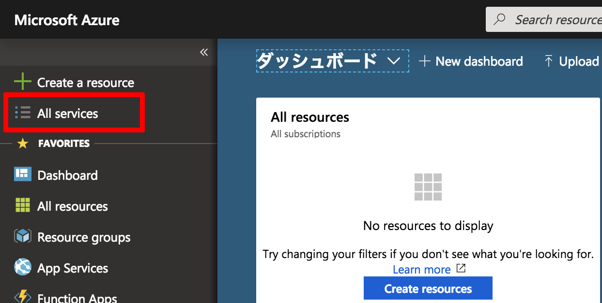
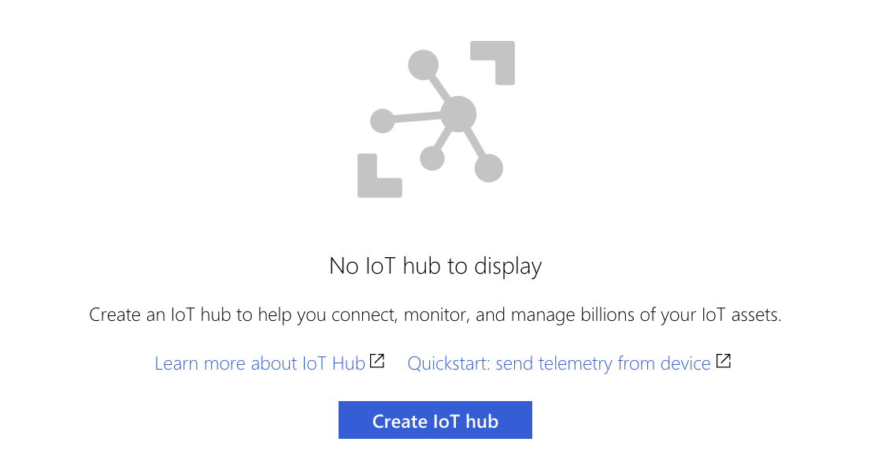
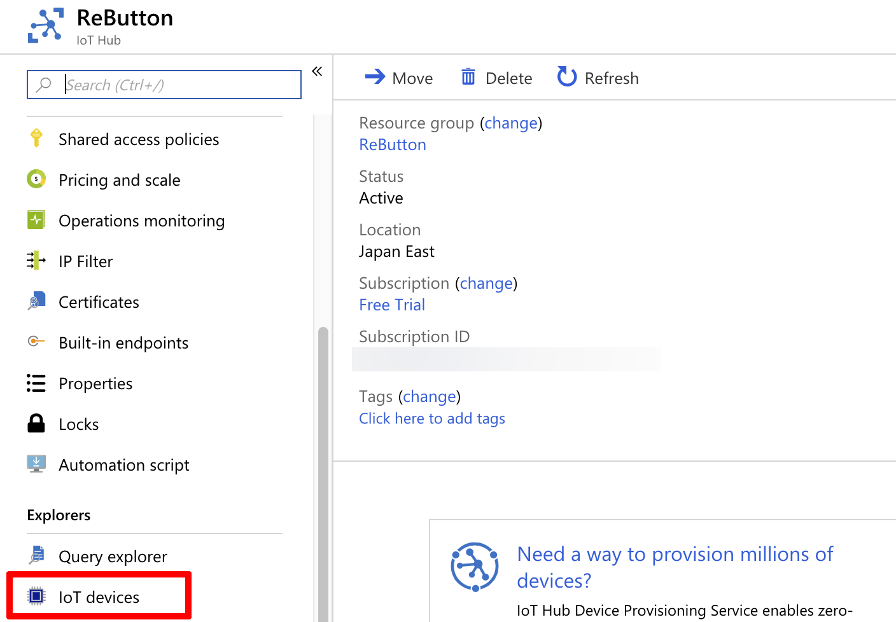
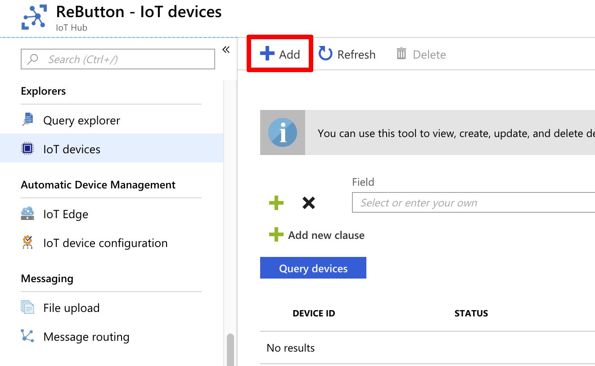

# Getting started with Azure IoT Hub
---
Legal Disclaimer  
This page was provided just to provide a convenience for users. Seeed is not responsible for any errors or omissions, or for the results obtained from the use of this information. All information in this page is provided "as is", with no guarantee of completeness, accuracy, timeliness or of the results obtained from the use of this information.

---

You can learn about "Azure IoT Hub" at [here](https://docs.microsoft.com/en-us/azure/iot-hub/about-iot-hub), and pricing could be found [here](https://azure.microsoft.com/en-us/pricing/details/iot-hub/).

  

When you just get sign in to Azure portal, you will see the dashboard. To find "IoT Hub", click "All services".

  

So, you will see this picture. Click "Create IoT Hub" to create new one.

  

Please choose suitable `subscription` and `region`. `Resource Group` could be empty, so please create and choose one. And name your IoT Hub and click `Next: Size and scale`.

  

On scale, I choose `F1: Free tier` since I just want to try seeing how the ReButton and Azure IoT Hub works. There are limitation on free tier but it could be enough for trial. Click `Review + create` button.

So that you can review your choice. If it is correct, click `Create` button.

Deployment of IoT Hub may take a few minutes.

  

After getting deployment complete, click the name of `Resource`.

  

And then, choose `IoT Device`

  

 and click `Add` button.
 
  

To add a device, put `Device ID` and click `Save` button.

  

Added. To grab the `Connection string`, click the device ID.

  

You can see keys and connection strings. You will use `Connection string (primary key)`, so click the copy button for that.

