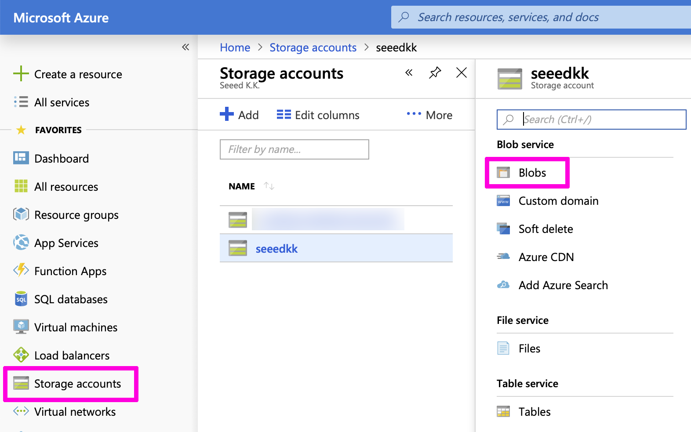

## Step 1 : Uploading firmware binary to Azure Storage

You can upload ReButton firmware binary to Azure Storage wiith [Azure CLI](https://docs.microsoft.com/en-us/cli/azure/) tool.

### 1.1 : Install Azure CLI

Please refer to Azure CLI install instruction [here](https://docs.microsoft.com/en-us/cli/azure/install-azure-cli)

### 1.2 : Create a new storage account

To use Azure Storage, you need a storage account. You can create a new Azure Storage account after you've configured your computer to connect to your subscription.

```
az storage account create \
    --location <location> \
    --name <account_name> \
    --resource-group <resource_group> \
    --sku <account_sku>
```
e.g.
```
az storage account create --location japaneast --name seeedkk --resource-group ReButton --sku Standard_GRS
```
You can use same resource group to IoT Hub.

### 1.3: Set default Azure storage account

First, display your storage account keys by using following account.
```
az storage account keys list \
    --account-name <account_name> \
    --resource-group <resource_group> \
    --output table
```
e.g.
```
az storage account keys list --account-name seeedkk --resource-group ReButton
```

Now that you have the key, you can define it and the account name as environment variables:

```
export AZURE_STORAGE_ACCOUNT=<account_name>
export AZURE_STORAGE_KEY=<key>
```

### 1.4 Create a container

Every blob in Azure storage must be in a container. You can create a container by using following command.
```
az storage container create --name <container_name> --public-access container
```

### 1.5 Upload a blob to a container

And you can upload firmware binary to Azure storage with following command.
```
az storage blob upload \
    --file <local_file_path> \
    --container-name <container_name> \
    --name <blob_name>
```
e.g.
```
az storage blob upload -f ReButtonApp.1.0.bin --container-name rebuttonfirm --name ReButtonApp.1.0.bin
```

### 1.6: Grab the URL

You can find the URL of uploaded blob on [Azure Portal](https://portal.azure.com).

On the portal, please find `Storage accounts` in `All services` and then choose storage accounts you used to upload, and choose `Blobs`.



In the container you have just used, you can find uploaded file(blob). By clicking the filename, you can refer the URL.

## Step 2: Calculate CRC

CRC can calclulate with [generatecrc](https://github.com/SeeedJP/ReButton/tree/master/tools/generatecrc) command we are providing in this repository.

example:
```
$ cd generatecrc
$ ./generatecrc ../ReButtonApp.1.0.bin
========== ReButton Firmware Information ==========

Package path: ../ReButtonApp.1.0.bin
Package CRC: 0xbc3b
Package size: 641924

===================================================
```

## Step 3: OTA process

1. Enter ReButton to AP mode by press hold the button until RGB LED turns into White. 
1. Browse to ReButton - Home page then click `Firmware Update`.
1. Enter following information.
  - `Package URI` - got on Step 1.6
  - `Package CRC` - got on Step 2.
  - `Package Size` - got on Step 2.
1. **While holding (physical) button of ReButton**, click `Update`.
1. Hold button until RGB LED starts blinking. ReButton is downloading the firmware image, checking CRC, and flashing new image. **This will take about 30 seconds.**
1. Release button when RGB LED turns into White. So that you are entering AP mode with new firmware.
1. Please set-up ReButton Wi-Fi connection and Azure connection settings on this AP mode.
